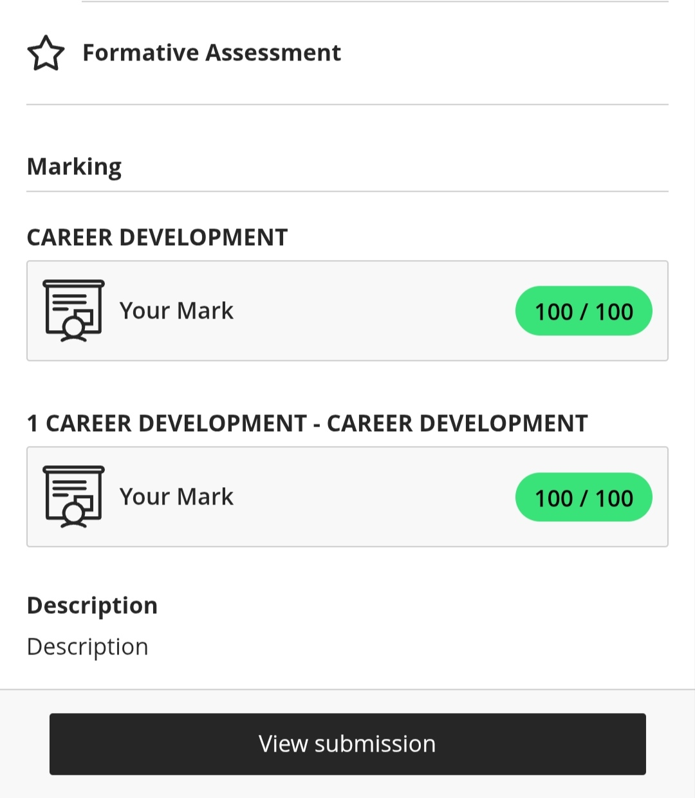
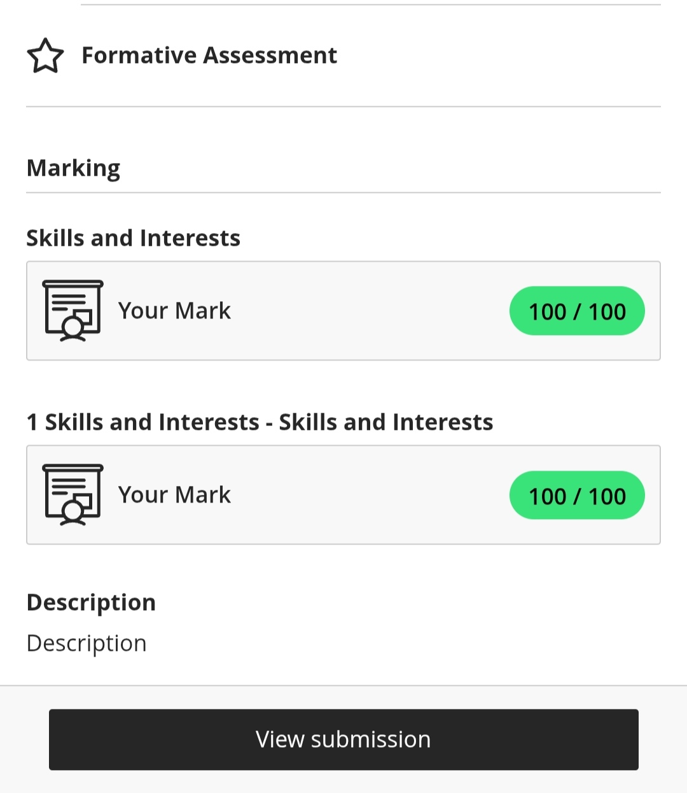

# Digital-Portfolio

## Career Counseling

### Evidence

#### Situation
As part of my work readiness training, I recently completed a **Career Development formative assessment** designed to evaluate my understanding of career counseling principles and how they can be applied to personal and professional growth. This assessment tested my knowledge of various career development theories and strategies, and I was proud to achieve a perfect score of **100 out of 100**.

#### Task
The main objectives of this task were to:

- Demonstrate an understanding of career development theories and planning models.
- Apply those strategies to my own career journey.
- Explore resources that assist in career decision-making.
- Recognize the role of self-awareness in achieving long-term job satisfaction and professional success.

#### Action
To complete this assessment successfully, I:

- Studied key career development theories, including **Holland’s RIASEC model** and **Super’s Life-Span Theory**, to understand how personality and life stages influence career choices.
- Completed career interest inventories and skill assessments to gain more self-awareness.
- Researched labor market trends specific to the **ICT field**, helping me align my goals with real-world opportunities.
- Developed a personal career action plan that included both short-term steps and long-term aspirations.
- Practiced articulating my career ambitions in a clear and focused manner.

#### Result
The result was a **stronger sense of direction and confidence** in my career planning. I not only achieved a perfect score on the assessment but also developed a **clearly defined career pathway** that aligns with my strengths, interests, and values. I now feel more equipped to make informed career decisions and understand how to use career development tools and resources to support my growth.

This experience has prepared me to **present myself professionally** in my digital portfolio and during job application processes.

## Skills and Interests

### Evidence

#### Reflection

##### Situation
During my work readiness training, I completed the **Skills and Interests module**, which focused on helping students explore the differences between learned skills and natural interests, while also emphasizing the importance of personal values in career planning. This module required me to differentiate between skills and interests, identify transferable skills, and understand how values influence career decisions.

##### Task
My objectives were to:

- Understand the distinction between **skills** and **interests**.
- Identify examples of **transferable skills**.
- Reflect on how my **personal values** influence my professional decisions and career path.
- Demonstrate my understanding through a series of **multiple-choice assessments**.

##### Action
To complete the module effectively, I:

- Carefully reviewed all the provided learning materials.
- Reflected on my current **skillset** and how it connects with my career goals.
- Evaluated my **core values**, such as **integrity** and **creativity**, and considered how they influence my career-related decisions.
- Practiced identifying **transferable skills** using examples from the module.
- Completed all assessment questions with full focus and attention.

##### Result
As a result, I developed a clear understanding that:

- **Skills** are acquired abilities.
- **Interests** are natural preferences that guide professional fulfillment.

I gained confidence in recognizing my own **marketable skills**, such as **problem-solving** and **communication**, and how they align with specific career roles. I also achieved a **perfect score** on the assessment, demonstrating a strong comprehension of the material.

This reflection has strengthened my **self-awareness** and will support me when building my **CV** and planning my **professional growth**.

## Personality Assessment

### Evidence

#### Situation
As part of my ongoing professional development in the **Diploma of Information and Communication Technology**, I participated in a detailed personality assessment. This activity was intended to help me understand how my personality traits, work preferences, and behavior patterns might affect my career choices and performance in the workplace.

#### Task
The main goals of this task were to:

- Identify my key **personality traits**.
- Explore how these traits align with various roles within the **ICT industry**.
- Recognize both **strengths** and **areas for improvement** in my work habits.
- Learn how to work effectively with individuals who have **different personality types**.

#### Action
To engage with the assessment meaningfully, I:

- Thoroughly reviewed my results to gain insight into my natural tendencies.
- Compared my traits with qualities often found in successful ICT professionals.
- Analyzed how traits like being **analytical**, **introverted**, or **detail-oriented** could support my role in ICT environments.
- Identified situations where my personality would be a strength, such as focused problem-solving tasks.
- Thought through strategies for addressing potential challenges, like collaborating with highly extroverted team members.
- Reflected on ways to adjust my communication and teamwork strategies to better align with colleagues who have different personality styles.

#### Result
This process gave me a clearer picture of my personality profile and how it fits within the ICT field. I gained useful insight into:

- The work settings and roles that best suit my natural characteristics.
- Strategies to present my personality strengths in interviews and job applications.
- A greater appreciation for the diversity of working styles in team environments.
- How to collaborate more effectively across different personalities.

Including these results in my digital portfolio provides strong evidence of my **self-awareness** and readiness to contribute meaningfully to professional ICT teams.

## CV Creation

### Evidence

#### Situation
As part of my work readiness training, I was assigned the task of creating a professional CV that would effectively represent my skills, education, and experience to potential employers in the **Information and Communication Technology (ICT)** field.

#### Task
The key objectives were to:

- Structure a well-organized, **Applicant Tracking System (ATS)-friendly** CV.
- Highlight my most relevant **skills**, academic background, and work experience.
- Maintain a clear and professional layout.
- Ensure the document was ready for submission by the deadline.

#### Action
To complete this task successfully, I:

- Researched industry-standard CV formats tailored for ICT roles.
- Selected a clean, professional template that ensured clarity and readability.
- Carefully listed my **technical skills** (programming languages, software tools, frameworks) and **soft skills** (teamwork, time management, communication).
- Included relevant coursework, major academic projects, and certifications that add value to my profile.
- Proofread the document multiple times to eliminate grammar or formatting errors.
- Saved the CV in a professional format ready for submission.

#### Result
The end result was a polished, professional CV that effectively markets my strengths and experiences to employers. It was:

- Well-structured and optimized for ATS screening.
- Free of errors and showcased attention to detail.
- A strong foundation for my job search and adaptable for future applications.

This task also boosted my confidence in presenting myself professionally in the job market.

## CV Submission

### Evidence

#### Situation
Following the completion of my CV, I moved on to submitting the document for review. This submission was a critical step to ensure my CV met both academic standards and real-world employability expectations.

#### Task
The submission required me to:

- Upload the CV in the correct file format (**PDF** or **DOCX**).
- Ensure all sections were complete and properly formatted.
- Submit the document on or before the stated deadline to avoid penalties.

#### Action
To ensure a smooth submission process, I:

- Double-checked the document to confirm it was saved in the correct file type and formatting was preserved.
- Reviewed every section (Education, Skills, Work Experience, Certifications, Contact Details) for accuracy and professionalism.
- Confirmed that my contact information was current and easy to read.
- Submitted the CV well ahead of the deadline to avoid last-minute technical issues.
- Followed all instructions carefully, including naming conventions.

#### Result
Through this process, I strengthened my understanding of professional submission protocols and the importance of meeting deadlines, both essential in job applications. I reinforced the value of submitting high-quality, error-free work on time.

This experience shows my ability to follow through on professional responsibilities and gives me confidence in handling future application tasks independently.

